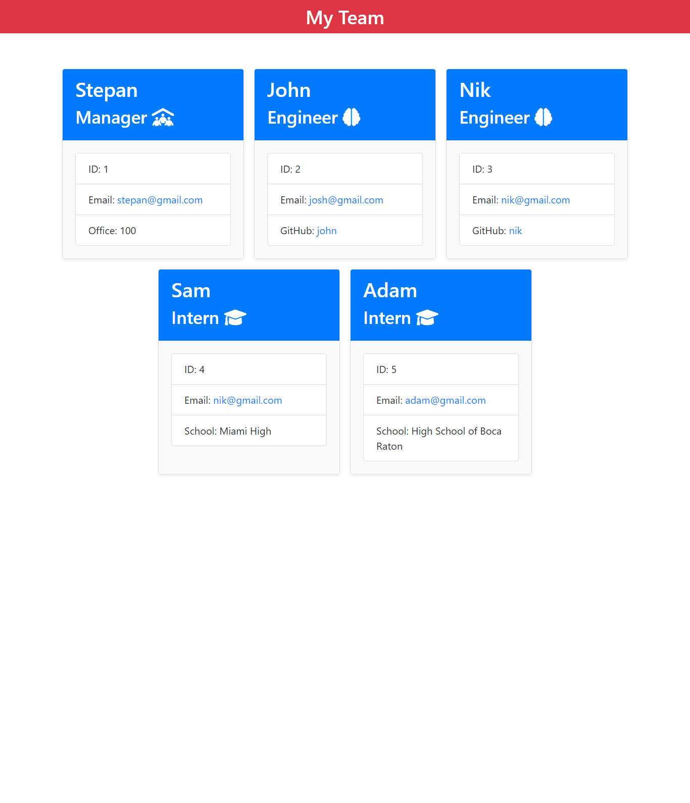

# Stepan Matysik's Team Profile Generator
> Team Profile project. A video with a team project description.
> Live demo [_here_](https://youtu.be/A1Pvhj1zYf8). 

## Table of contents
* [General info](#general-info)
* [Technologies](#technologies)
* [Installation](#installation)
* [Instructions](#instructions)
* [Features](#features)
* [Screenshots](#screenshots)
* [Usage](#usage)
* [Project Status](#project-status)
* [Room for Improvement](#room-for-improvement)
* [Acknowledgements](#acknowledgements)
* [Contacts](#contact)


## General Info
This project is a team profile generator. Uses back end to simplify the process of creation a website with valuable information.
## Technologies
Project is created with:
- HTML
- CSS
- JavaScript
- Node.js
- npm

## Installation
To open this project in vscode using git in Terminal/Git Bash:

```
$ cd in directory there you want to store your project
$ git clone https://github.com/elfsvet/stepan-matysik-team-profile-generator.git
$ code .
```

## Instructions
1. You would need to run commands in terminal at the directory of the project:
```
$npm install inquirer
$npm install --save-dev jest
```
2. To run application:
```
$node index.js
```
3. Follow the questions and steps.
4. Check the dist folder.

## Features
- Inquirer package
- Jest package

## Screenshots


If you haven't checked the link to the video with the application process please [CLICK HERE ⬇️](https://youtu.be/A1Pvhj1zYf8)


## Usage
For creating a team and have easy access to the contact information.
## Project Status
Project is: _complete_

## Room for Improvement
To do:
- We can feature the team members by their ranks

## Acknowledgements
- This project was inspired by UM Coding Boot Camp
- This project was creating from scratch using a gif picture.

## Contact
Created by [@elfsvet](https://github.com/elfsvet)
- [LinkedIn](https://www.linkedin.com/in/stepanmatysik/)